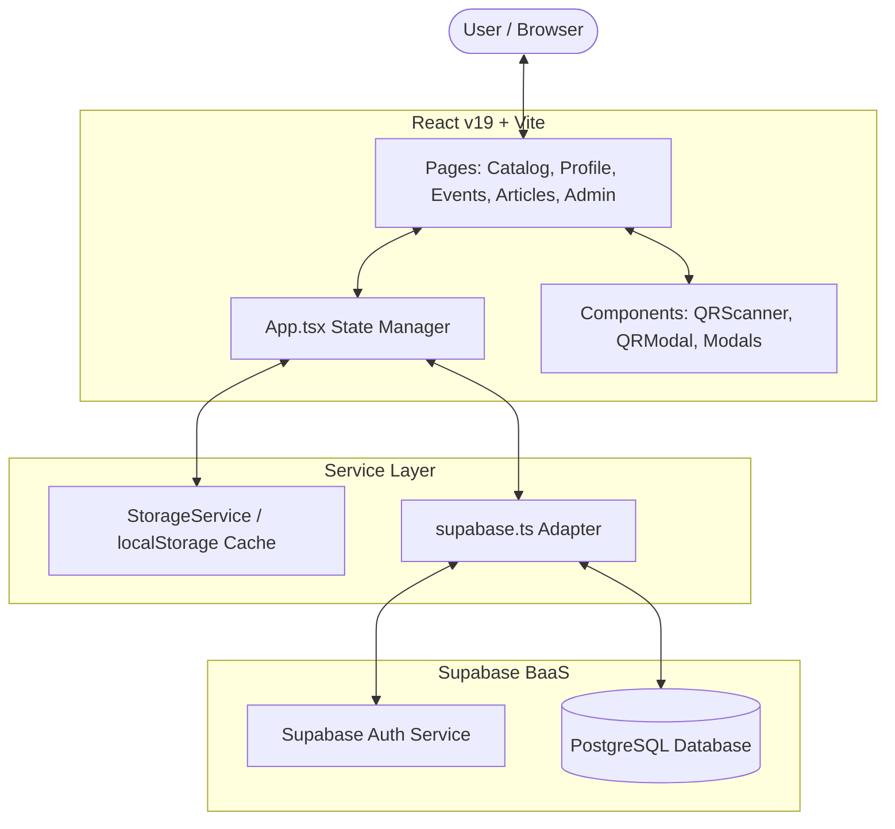
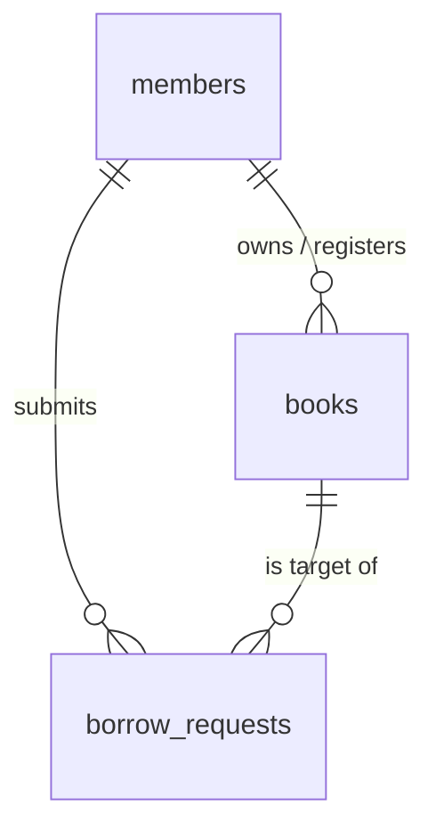
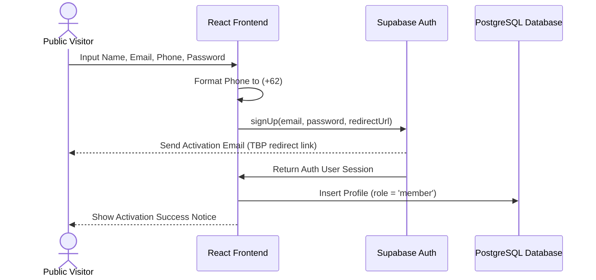
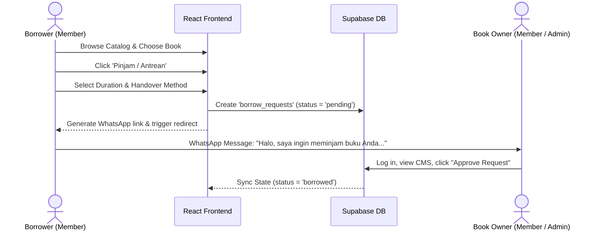
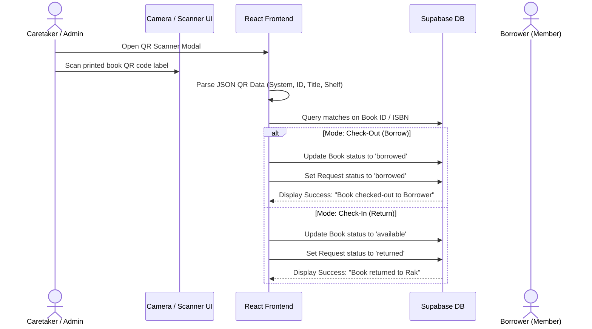
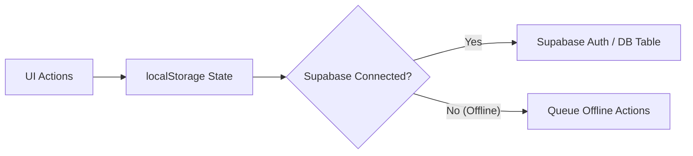

# Tangsel Book Party — System Architecture & User Flow Documentation

This document describes the software architecture, database design, integration patterns, and end-to-end user workflows for the **Tangsel Book Party** community library system.

---

## 1. High-Level Architecture Overview

Tangsel Book Party is built as a highly responsive single-page application (SPA) with real-time server persistence (Supabase) and offline-first client storage caching.

### Key Architectural Layers:
1. **Presentation Layer (React & Tailwind CSS v4)**: A premium, mobile-first responsive interface that drives catalog discovery, event browsing, article reading, and admin workspace management.
2. **Service Layer (`StorageService` & `supabase.ts`)**:
   * **`StorageService`**: Acts as an offline-first state synchronizer and fallback manager. Operates on `localStorage` keys for instant page loads.
   * **`supabase.ts`**: Handles DB queries, real-time syncs, user registration via `supabase.auth`, and secure database updates (`upsert` actions).
3. **Data & Auth Layer (Supabase BaaS)**:
   * **Supabase Auth**: Enforces email sign-up/sign-in, token issuance, and secure redirects.
   * **PostgreSQL Database**: Persists tables for `members`, `books`, `borrow_requests`, `events`, and `articles`.

---

## 2. Database Schema Design

The community library operates on a Peer-to-Peer schema where books can be owned by either the central community library or personal members.

### Table Definitions & Constraints

#### A. `members` Table
Stores authentication profiles, authorization roles (`member` or `admin`), and community details.
* **Security Policy**: Regular registrations via the public web form strictly receive the `role = 'member'` flag. Admin promotion is managed directly in PostgreSQL.

| Column | Type | Constraints | Description |
| :--- | :--- | :--- | :--- |
| `id` | `TEXT` | `PRIMARY KEY` | Match with Supabase Auth UID |
| `name` | `TEXT` | `NOT NULL` | Full Name of the member |
| `email` | `TEXT` | `UNIQUE` / `NOT NULL` | Login Email |
| `phone` | `TEXT` | `NOT NULL` | WhatsApp active number |
| `avatar` | `TEXT` | | SVG/PNG avatar image URL |
| `joined_date` | `TEXT` | | Community join date (e.g., "Agustus 2026") |
| `role` | `TEXT` | Default `'member'` | Auth role: `'member'` or `'admin'` |
| `wishlist` | `TEXT[]` | Default `'{}'` | Book IDs marked as favorite |

#### B. `books` Table
Contains metadata for both community-owned books and member-owned peer books.

| Column | Type | Constraints | Description |
| :--- | :--- | :--- | :--- |
| `id` | `TEXT` | `PRIMARY KEY` | Custom Book ID (e.g., `TBP-BOOK-001`) |
| `title` | `TEXT` | `NOT NULL` | Book title |
| `author` | `TEXT` | `NOT NULL` | Book author |
| `isbn` | `TEXT` | | International Standard Book Number |
| `genre` | `TEXT` | `NOT NULL` | Genre (e.g., Fiksi, Non-Fiksi, Bisnis) |
| `cover_image` | `TEXT` | | Public URL to the book cover photo |
| `synopsis` | `TEXT` | | Short summary of the book |
| `status` | `TEXT` | Default `'available'` | `'available'`, `'borrowed'`, or `'reserved'` |
| `owner_id` | `TEXT` | `REFERENCES public.members(id)` | User ID of the book owner |
| `owner_name` | `TEXT` | `NOT NULL` | Owner name (default `'Komunitas Tangsel'`) |
| `shelf_location`| `TEXT` | `NOT NULL` | Location in the community bookshelf |

#### C. `borrow_requests` Table
Tracks borrowing status, handovers, approvals, and due dates.

| Column | Type | Constraints | Description |
| :--- | :--- | :--- | :--- |
| `id` | `TEXT` | `PRIMARY KEY` | Unique ID (e.g., `REQ-1234`) |
| `book_id` | `TEXT` | `REFERENCES public.books(id)` | Target book being requested |
| `book_title` | `TEXT` | `NOT NULL` | Redundant title for fast displays |
| `owner_id` | `TEXT` | `REFERENCES public.members(id)` | User ID of the book owner |
| `user_id` | `TEXT` | `REFERENCES public.members(id)` | Requester (Borrower) User ID |
| `request_date` | `TEXT` | `NOT NULL` | Submission date |
| `due_date` | `TEXT` | | Due date for return |
| `status` | `TEXT` | Default `'pending'` | `'pending'`, `'approved'`, `'borrowed'`, `'returned'`, `'rejected'` |
| `handover_method`| `TEXT`| Default `'meetup'` | Handover type: `'meetup'` or `'courier'` |

---

## 3. End-to-End User Flows

### A. Authentication & Activation Flow
Secures the creation and activation of regular member accounts while preventing unauthorized elevation of admin privileges.

---

### B. Peer-to-Peer Book Borrowing Flow
Outlines how members request books from other members (or the community) and finalize WhatsApp-based communication.

---

### C. In-Person QR Code Scanning Handover Flow
Simplifies local physical book exchanges during community picnics and meetups.

---

## 4. Sync & Fallback Operations

To maintain absolute usability regardless of network conditions, the platform implements a synchronized dual-layer storage routine.

* **Immediate Page Load**: The React application initializes state from local storage.
* **Asynchronous Database Handshake**: A background promise resolves `fetchBooksFromSupabase()` and related tables:
  * If remote records exist, they update local cache.
  * If remote tables are empty (new backend spin up), local configurations automatically populate Supabase.
* **Foreign Key Safeguard**: The service layer sanitizes relation fields (`owner_id`, `user_id`) against local cache properties before submitting database upserts, protecting the application from constraint errors and silent failures.
