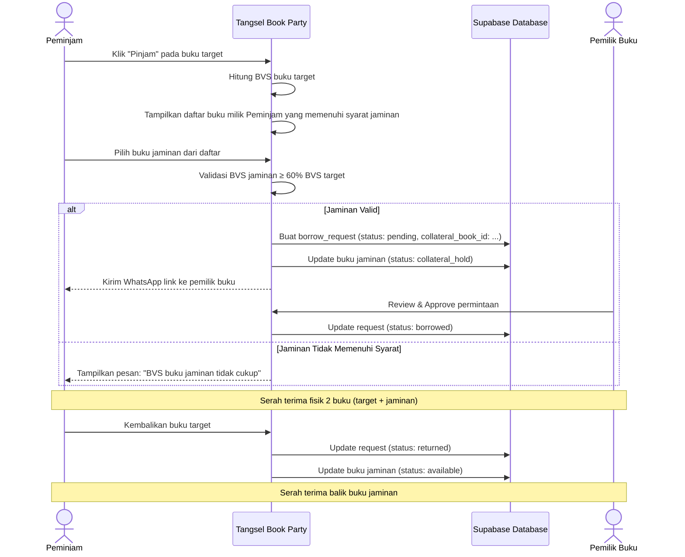

# PRD — Sistem Jaminan Buku (Book Collateral System — Simplified MVP)

> **Versi**: 2.0 (Simplifikasi MVP)  
> **Tanggal**: 3 Agustus 2026  
> **Penulis**: System Architect  
> **Status**: Approved — Simplifikasi MVP Manual Review

---

## 1. Masalah yang Dipecahkan

**Pain Point**: Dalam komunitas pinjam-meminjam buku fisik, risiko terbesar adalah buku yang tidak dikembalikan. Tanpa jaminan, pemilik buku enggan mendaftarkan koleksi berharganya ke katalog komunitas.

**Solusi**: Peminjam **wajib menawarkan salah satu buku miliknya sebagai jaminan (collateral)** selama masa peminjaman. Buku jaminan "dititipkan" kepada pemilik/petugas perpustakaan saat serah terima, dan dikembalikan setelah buku pinjaman dikembalikan.

> [!TIP]
> **Analogi sederhana**: Seperti sistem "tukar sementara". Kamu pinjam bukuku, aku pegang bukumu. Selesai pinjam, kita tukar balik.

---

## 2. Prinsip Desain MVP

| # | Prinsip | Penjelasan |
|---|---------|------------|
| 1 | **Simpel & Praktis (No Over-engineering)** | Menghapus rumus matematika kaku BVS. Cukup 1 langkah: peminjam memilih buku jaminan miliknya dari dropdown atau mencatat janji jaminan manual. |
| 2 | **Manual Review Petugas / Pemilik** | Petugas Caretaker Admin & Pemilik buku dapat memeriksa & menyetujui jaminan fisik secara manual saat serah terima. |
| 3 | **Mutual Trust** | Bukan hukuman, tapi mekanisme saling percaya — kedua pihak "menitipkan" sesuatu. |
| 4 | **Inklusif Bagi Member Baru** | Member baru yang belum punya koleksi terdaftar dapat menuliskan janji jaminan manual / kesepakatan COD ke petugas. |

---

## 3. Book Value Score (BVS) — Sistem Penilaian Buku

Setiap buku di katalog otomatis mendapatkan **Book Value Score (BVS)** dengan skala **1–100 poin**. Skor ini dihitung dari 4 komponen metadata yang sudah ada di database.

### 3.1. Komponen Skor

| Komponen | Bobot | Cara Hitung | Alasan |
|----------|-------|-------------|--------|
| **Kondisi Fisik** | 40% | `Baik` = 40, `Cukup` = 25, `Kurang` = 10 | Faktor terpenting — buku rusak sulit ditukar |
| **Jumlah Halaman** | 20% | `≥300` = 20, `150-299` = 14, `<150` = 8 | Buku tebal umumnya bernilai lebih tinggi |
| **Tahun Terbit** | 20% | `≥2020` = 20, `2010-2019` = 14, `<2010` = 10 | Buku baru lebih diminati & kondisinya lebih terjaga |
| **Rating Komunitas** | 20% | `rating × 4` (max 20) | Buku populer = lebih berharga bagi komunitas |

### 3.2. Contoh Perhitungan BVS

```
Buku: "Atomic Habits" — James Clear
├─ Kondisi: Baik           → 40 poin
├─ Halaman: 320 (≥300)     → 20 poin
├─ Tahun: 2018 (2010-2019) → 14 poin
├─ Rating: 4.9 × 4         → 19.6 → 20 poin (max)
└─ TOTAL BVS               = 94 / 100
```

```
Buku: Novel pendek — penulis indie
├─ Kondisi: Cukup          → 25 poin
├─ Halaman: 120 (<150)     → 8 poin
├─ Tahun: 2008 (<2010)     → 10 poin
├─ Rating: 3.5 × 4         → 14 poin
└─ TOTAL BVS               = 57 / 100
```

### 3.3. Fungsi Kalkulasi BVS

```typescript
function calculateBVS(book: Book): number {
  // 1. Kondisi Fisik (40%)
  const conditionMap: Record<string, number> = {
    'Baik': 40, 'Cukup': 25, 'Kurang': 10
  };
  const conditionScore = conditionMap[book.conditionGrade || 'Baik'] || 25;

  // 2. Jumlah Halaman (20%)
  let pageScore = 8;
  if (book.pageCount >= 300) pageScore = 20;
  else if (book.pageCount >= 150) pageScore = 14;

  // 3. Tahun Terbit (20%)
  let yearScore = 10;
  if (book.publishYear >= 2020) yearScore = 20;
  else if (book.publishYear >= 2010) yearScore = 14;

  // 4. Rating Komunitas (20%)
  const ratingScore = Math.min(20, Math.round(book.rating * 4));

  return conditionScore + pageScore + yearScore + ratingScore;
}
```

---

## 4. Aturan Jaminan (Collateral Rules)

### 4.1. Syarat Utama

| Aturan | Detail |
|--------|--------|
| **Minimum BVS Jaminan** | BVS buku jaminan ≥ **60%** dari BVS buku yang dipinjam |
| **Kondisi minimum** | Buku jaminan harus berkondisi **"Cukup"** atau **"Baik"** (tidak boleh "Kurang") |
| **Status buku jaminan** | Harus berstatus `available` (tidak sedang dipinjam orang lain) |
| **Kepemilikan** | Buku jaminan harus terdaftar di katalog atas nama peminjam |

### 4.2. Contoh Validasi

```
Buku yang ingin dipinjam: "Atomic Habits" (BVS = 94)
Minimum BVS jaminan: 94 × 60% = 56.4 → dibulatkan ke 57

✅ "Psychology of Money" (BVS = 82) → LOLOS (82 ≥ 57)
✅ "Novel Indie" (BVS = 57)         → LOLOS (57 ≥ 57, pas batas)
❌ "Komik Bekas" (BVS = 38)         → DITOLAK (38 < 57)
```

### 4.3. Pengecualian (Grace Rules)

| Skenario | Kebijakan |
|----------|-----------|
| **Peminjam belum punya buku terdaftar** | Boleh meminjam buku dengan BVS ≤ 50 **tanpa jaminan**, maksimal 1 pinjaman aktif |
| **Buku milik komunitas (bukan member)** | Threshold jaminan turun ke **40%** karena buku komunitas bersifat kolektif |
| **Member dengan trust score tinggi** | Member yang sudah mengembalikan ≥ 5 buku tepat waktu mendapat trust badge "Terpercaya" dan threshold turun ke **50%** |

---

## 5. Alur Peminjaman dengan Jaminan

### 5.1. Sequence Diagram



### 5.2. Status Buku Jaminan

Buku yang dijadikan jaminan mendapatkan status khusus:

```
available → collateral_hold → available
```

| Status | Artinya |
|--------|---------|
| `available` | Buku bisa dipinjam atau dijadikan jaminan |
| `borrowed` | Buku sedang dipinjam orang lain |
| `collateral_hold` | **Buku sedang digunakan sebagai jaminan** — tidak bisa dipinjam/dihapus |

---

## 6. Perubahan Database

### 6.1. Kolom Baru pada Tabel `books`

| Kolom | Tipe | Default | Deskripsi |
|-------|------|---------|-----------|
| `condition_grade` | `TEXT` | `'Baik'` | Kondisi fisik: `'Baik'`, `'Cukup'`, `'Kurang'` |
| `bvs_score` | `INT` | `null` | Book Value Score (auto-calculated, 1-100) |

### 6.2. Kolom Baru pada Tabel `borrow_requests`

| Kolom | Tipe | Default | Deskripsi |
|-------|------|---------|-----------|
| `collateral_book_id` | `TEXT` | `null` | ID buku yang dijadikan jaminan |
| `collateral_book_title` | `TEXT` | `null` | Judul buku jaminan (untuk display cepat) |

### 6.3. Update pada `BookStatus` Type

```typescript
// Before
export type BookStatus = 'available' | 'borrowed' | 'reserved';

// After
export type BookStatus = 'available' | 'borrowed' | 'reserved' | 'collateral_hold';
```

---

## 7. Dampak pada UX

### 7.1. Flow Peminjaman (BorrowModal)

Penambahan **1 langkah** di modal peminjaman:

```
Step 1: Pilih durasi & metode serah terima     (sudah ada)
Step 2: Pilih buku jaminan dari koleksi Anda   (BARU)
Step 3: Konfirmasi & kirim permintaan           (sudah ada)
```

### 7.2. Tampilan Buku Jaminan yang Eligible

Di Step 2, sistem menampilkan:
- Daftar buku milik peminjam yang berstatus `available`
- BVS setiap buku ditampilkan sebagai badge visual (Hijau ≥ 70, Kuning 50-69, Merah < 50)
- Buku yang tidak memenuhi syarat ditampilkan grayed-out dengan tooltip alasan

### 7.3. Info BVS di Halaman Detail Buku

Setiap buku di katalog menampilkan badge BVS kecil di card:
- 🟢 **80-100**: Premium
- 🟡 **50-79**: Standard
- 🔴 **1-49**: Economy

---

## 8. Kenapa Sistem Ini Tidak Ribet?

| Aspek | Penjelasan |
|-------|------------|
| **Hanya 1 langkah tambahan** | Peminjam tinggal pilih 1 buku dari dropdown — tidak perlu isi form baru |
| **Skor otomatis** | BVS dihitung dari data yang sudah ada (halaman, tahun, rating, kondisi) — tidak perlu input manual |
| **Tidak menghalangi peminjam baru** | Grace rules memperbolehkan pinjam buku ringan tanpa jaminan |
| **Mutual benefit** | Pemilik buku merasa aman, peminjam termotivasi mengembalikan cepat |
| **Tidak ada uang** | Tetap sesuai prinsip komunitas — gratis, tanpa deposit finansial |

---

## 9. Skor & Prioritas Implementasi

| # | Task | Effort | Priority |
|---|------|--------|----------|
| 1 | Tambah `condition_grade` ke Book type & form | S | P0 |
| 2 | Implementasi fungsi `calculateBVS()` | S | P0 |
| 3 | Tambah `collateral_book_id` ke BorrowRequest type | S | P0 |
| 4 | Update `BookStatus` type dengan `collateral_hold` | XS | P0 |
| 5 | UI: Step pemilihan buku jaminan di BorrowModal | M | P1 |
| 6 | UI: Badge BVS di BookCard | S | P1 |
| 7 | Logic: Auto-release jaminan saat buku dikembalikan | S | P1 |
| 8 | Grace rules untuk peminjam tanpa buku | S | P2 |
| 9 | Trust score tracking | M | P2 |
| 10 | Database migration SQL | S | P1 |

> **Estimasi total effort**: ~2-3 hari kerja untuk MVP (P0 + P1)

---

## 10. SQL Migration

```sql
-- Add condition grade and BVS score to books table
ALTER TABLE public.books 
  ADD COLUMN IF NOT EXISTS condition_grade TEXT DEFAULT 'Baik',
  ADD COLUMN IF NOT EXISTS bvs_score INT;

-- Add collateral fields to borrow_requests table
ALTER TABLE public.borrow_requests 
  ADD COLUMN IF NOT EXISTS collateral_book_id TEXT REFERENCES public.books(id) ON DELETE SET NULL,
  ADD COLUMN IF NOT EXISTS collateral_book_title TEXT;

-- Update status constraint to include 'collateral_hold'
COMMENT ON COLUMN public.books.status IS 'Status: available, borrowed, reserved, collateral_hold';
```
