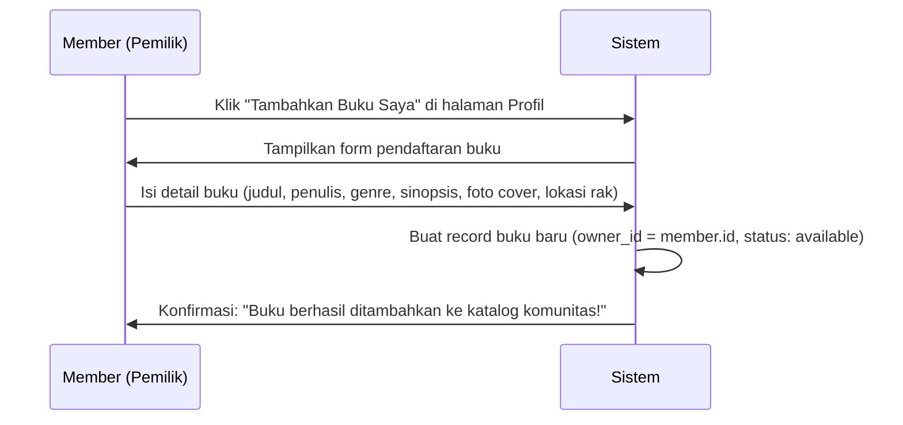
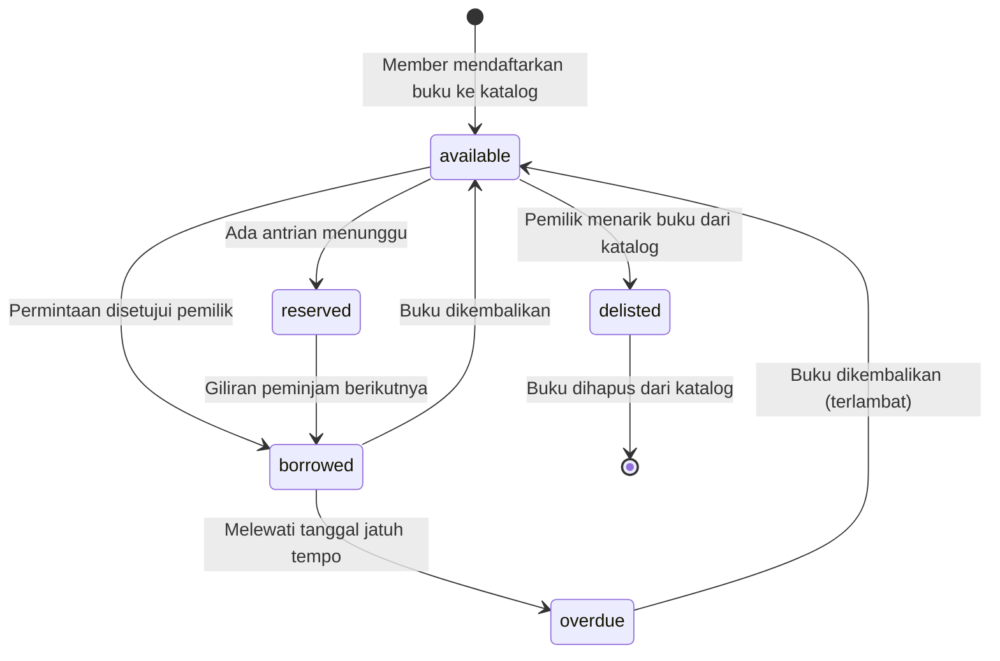
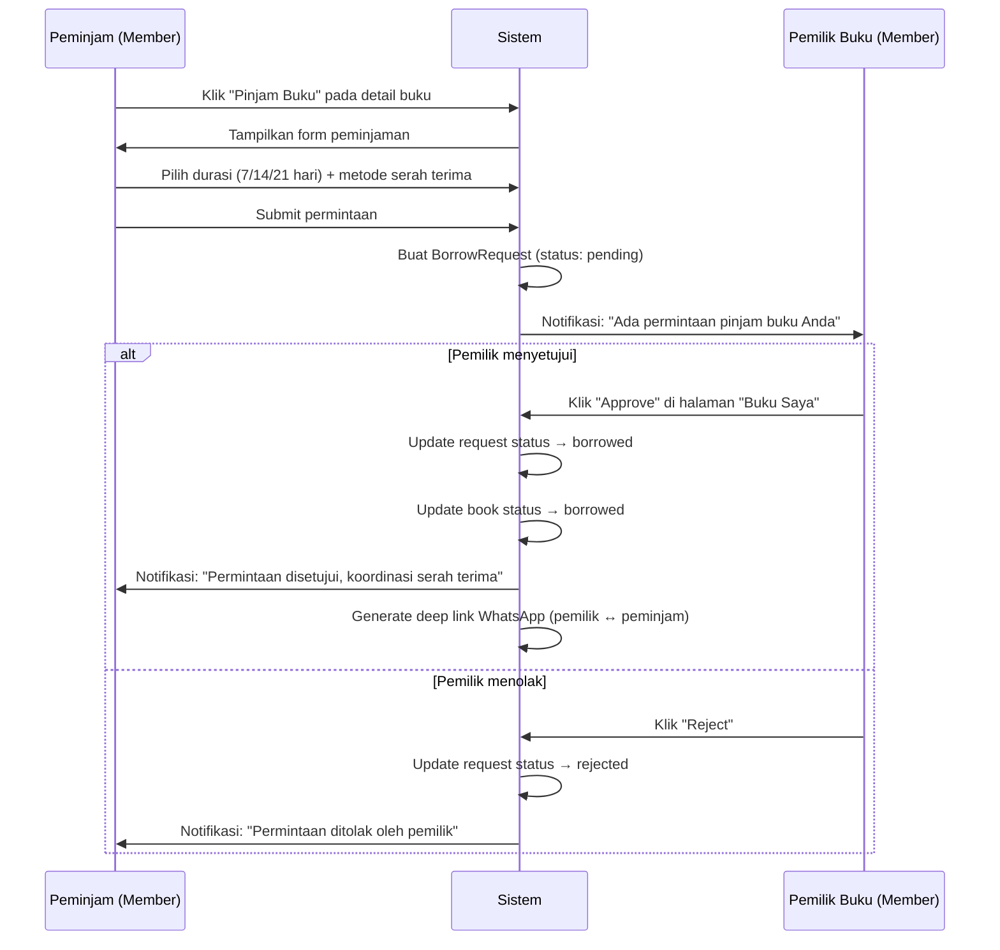
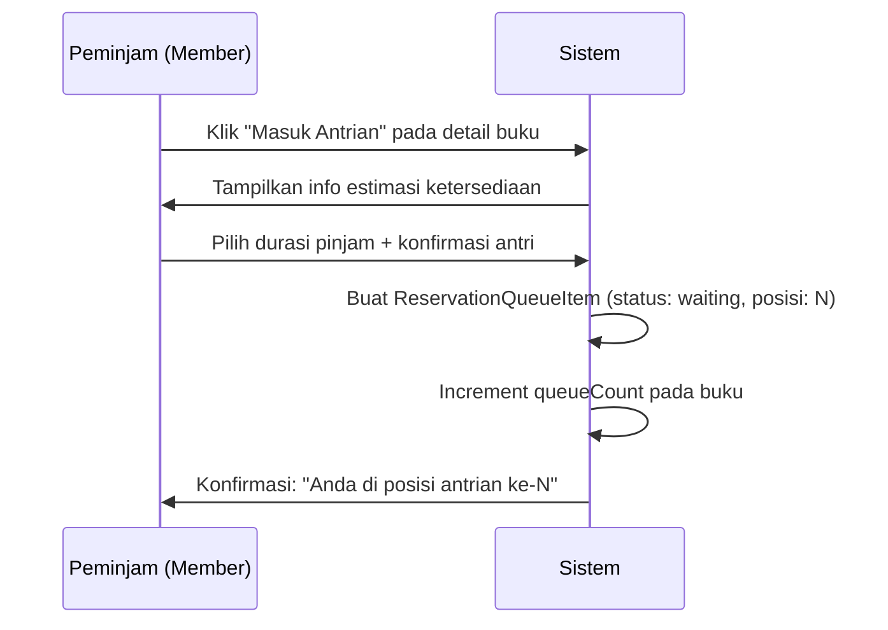
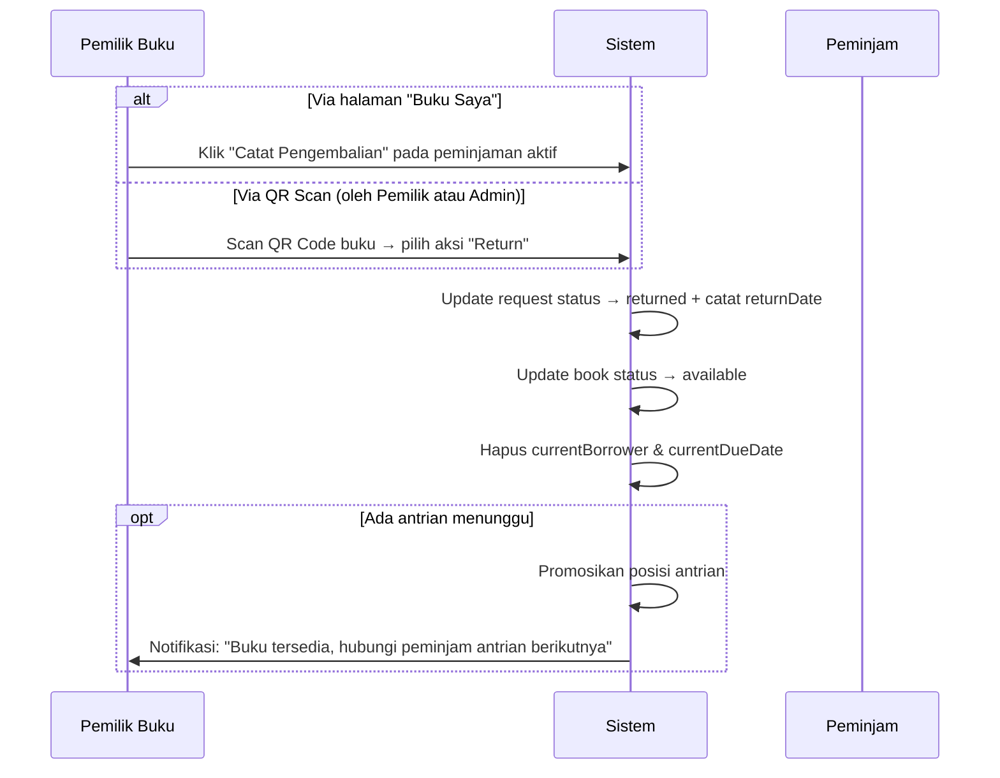
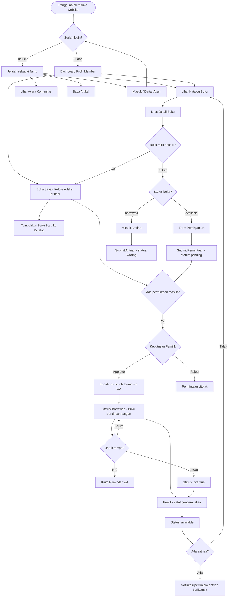

# PRD — Sistem Peminjaman Buku Fisik Tangsel Book Party

> **Versi**: 1.1 MVP  
> **Tanggal**: 1 Agustus 2026  
> **Penulis**: System Architect  
> **Status**: Draft — Menunggu Review

---

## 1. Ringkasan Produk

Tangsel Book Party adalah **perpustakaan fisik komunitas** di Tangerang Selatan dengan **dua sumber buku** dalam satu katalog bersama:

1. **Buku Milik Komunitas** — koleksi bersama yang dikelola oleh Admin. Admin yang meng-approve peminjaman.
2. **Buku Milik Member** — buku pribadi anggota yang didaftarkan ke katalog. Pemilik sendiri yang meng-approve peminjaman.

Semua peminjaman buku bersifat **gratis** (tanpa biaya sewa). Platform web ini mengelola seluruh siklus: dari pendaftaran buku, pencarian, pengajuan pinjam, persetujuan, serah terima fisik, hingga pengembalian.

### Prinsip Utama
- **Buku fisik** — bukan e-book. Harus ada serah terima barang nyata.
- **Gratis** — tidak ada biaya keanggotaan atau sewa.
- **Satu katalog, dua sumber** — buku komunitas dan buku pribadi member tampil bersama di katalog yang sama.
- **Pemilik = pengambil keputusan** — yang approve peminjaman adalah pemilik buku (member untuk buku pribadinya, Admin untuk buku komunitas).
- **Admin = moderator** — mengelola buku komunitas, CMS konten, dan mengintervensi jika ada sengketa antar member.

---

## 2. Peran Pengguna (User Roles)

### 2.1. Tamu (Guest)
Pengguna yang belum login. Akses terbatas.

| Bisa | Tidak Bisa |
|------|------------|
| Jelajah katalog buku | Ajukan peminjaman |
| Baca artikel & lihat event | Simpan wishlist |
| Lihat detail & review buku | Tambahkan buku ke katalog |
| Mendaftar akun baru | Akses profil |

### 2.2. Member (Anggota)
Pengguna terdaftar dengan `role = 'member'`. Berperan **ganda** sebagai peminjam sekaligus pemilik buku.

**Sebagai Peminjam:**

| Bisa |
|------|
| Ajukan peminjaman buku milik anggota lain |
| Masuk antrian (queue) jika buku sedang dipinjam |
| Simpan wishlist buku favorit |
| Lihat riwayat peminjaman sendiri |
| Tulis review & rating buku yang pernah dipinjam |

**Sebagai Pemilik Buku:**

| Bisa |
|------|
| Tambahkan buku pribadi ke katalog komunitas |
| Edit atau tarik (hapus) buku miliknya dari katalog |
| Approve / reject permintaan pinjam **atas buku miliknya** |
| Catat pengembalian **buku miliknya** |
| Kirim reminder WhatsApp ke peminjam buku miliknya |
| Lihat daftar siapa yang sedang meminjam buku miliknya |

**Batasan Member:**

| Tidak Bisa |
|------------|
| Approve permintaan atas buku milik orang lain |
| Mengelola CMS artikel / event |
| Mengubah role pengguna |
| Menghapus buku milik anggota lain |

### 2.3. Admin
Pengguna dengan `role = 'admin'`. Dibuat via promosi langsung di database Supabase.

| Bisa | Tidak Bisa |
|------|------------|
| Semua akses Member (pinjam & punya buku) | Mendaftar sebagai admin via form publik |
| Approve / reject **semua** permintaan pinjam (override pemilik) | — |
| Catat pengembalian **semua** buku (override pemilik) | — |
| Edit / hapus **semua** buku di katalog (moderasi) | — |
| CRUD artikel SEO & event komunitas | — |
| Scan QR Code untuk proses serah terima cepat | — |
| Kirim reminder WhatsApp ke siapapun | — |

> [!IMPORTANT]
> **Prinsip otorisasi**: Pemilik buku mengelola bukunya sendiri. Admin hanya melakukan **override** jika ada sengketa, buku tidak dikembalikan, atau pemilik tidak responsif.

---

## 3. Dua Sumber Buku dalam Satu Katalog

Konsep utama: katalog buku tidak hanya diisi oleh admin, tapi juga oleh member yang ingin meminjamkan buku pribadinya.

| | Buku Komunitas | Buku Milik Member |
|---|---|---|
| **Siapa yang list** | Admin | Member pemilik buku |
| **`owner_id`** | ID akun Admin | ID akun member tersebut |
| **Label di katalog** | "Koleksi Komunitas Tangsel" | "Dipinjamkan oleh: Budi (Bintaro)" |
| **Siapa yang approve** | Admin | Pemilik buku (member itu sendiri) |
| **Siapa yang catat return** | Admin | Pemilik buku |
| **Override oleh Admin** | — (sudah Admin) | ✅ Bisa override jika pemilik tidak responsif |
| **Bisa di-delist pemilik?** | Admin bisa hapus | Member bisa tarik (jika tidak sedang dipinjam) |

Dari sisi **peminjam**, alurnya sama persis — mereka tidak perlu tahu apakah buku itu milik komunitas atau milik member. Mereka hanya klik "Pinjam", lalu menunggu approval.

---

## 4. Alur Pendaftaran Buku oleh Member (Book Listing Flow)

Setiap anggota dapat mendaftarkan buku pribadinya ke katalog komunitas.

### 4.1. Proses Pendaftaran



### 4.2. Detail Form Pendaftaran Buku

| Field | Tipe | Wajib | Keterangan |
|-------|------|-------|------------|
| Judul Buku | Text | ✅ | — |
| Penulis | Text | ✅ | — |
| ISBN | Text | ❌ | Opsional, membantu identifikasi |
| Genre / Kategori | Select | ✅ | Fiksi, Non-Fiksi, Pengembangan Diri, Bisnis, Komik, dll. |
| Sinopsis | Textarea | ✅ | Deskripsi singkat isi buku |
| Foto Cover | Image Upload | ✅ | Foto asli buku fisik miliknya |
| Lokasi Rak / Wilayah | Text | ✅ | Contoh: "Bintaro Sector 7", "BSD Serpong", "Pamulang" |
| Jumlah Halaman | Number | ❌ | — |
| Tahun Terbit | Number | ❌ | — |
| Bahasa | Select | ✅ | Bahasa Indonesia, English, dll. |
| Metode Serah Terima | Checkbox | ✅ | Meetup / Kurir / Keduanya |

### 4.3. Aturan Kepemilikan

- Setiap buku memiliki `owner_id` yang merujuk ke `members.id`.
- **Hanya pemilik** (atau Admin) yang bisa mengedit atau menghapus buku tersebut.
- Pemilik bisa "menarik" (de-list) bukunya kapan saja, **kecuali** sedang ada peminjaman aktif (`status: borrowed`). Jika sedang dipinjam, buku harus dikembalikan dulu sebelum bisa ditarik.
- Label pemilik ditampilkan di detail buku: *"Dipinjamkan oleh: Budi (Bintaro)"*.

---

## 4. Status Lifecycle Buku



| Status | Arti | Aksi Tersedia |
|--------|------|---------------|
| `available` | Buku di tangan pemilik, siap dipinjam | Member lain: **Ajukan Peminjaman** |
| `borrowed` | Sedang dipinjam anggota lain | Member lain: **Masuk Antrian** |
| `reserved` | Ada antrian menunggu giliran | Member lain: **Masuk Antrian** (posisi selanjutnya) |
| `delisted` | Pemilik menarik buku dari katalog | Tidak bisa dipinjam |

---

## 5. Alur Peminjaman (Borrowing Flow)

### 5.1. Skenario A — Buku Tersedia (`available`)



> [!NOTE]
> **Siapa yang approve?** Secara default, **pemilik buku** yang meng-approve. Admin hanya melakukan override jika pemilik tidak responsif >48 jam atau ada sengketa.

**Detail Form Peminjaman:**

| Field | Tipe | Opsi | Wajib |
|-------|------|------|-------|
| Durasi Pinjam | Select | 7 hari, 14 hari, 21 hari | ✅ |
| Metode Serah Terima | Radio | `meetup` (Ketemu langsung) atau `courier` (Kurir / COD) | ✅ |
| Catatan | Textarea | Bebas, misal "Ambil di event Sabtu Bintaro" | ❌ |

### 5.2. Skenario B — Buku Sedang Dipinjam (`borrowed`)



**Saat buku dikembalikan dan ada antrian:**
1. Pemilik buku mencatat pengembalian (atau Admin override).
2. Sistem otomatis menandai orang di posisi antrian #1 sebagai `ready_for_pickup`.
3. Pemilik buku menghubungi peminjam antrian via WhatsApp untuk koordinasi serah terima.
4. Jika peminjam antrian tidak merespons dalam 48 jam → status menjadi `cancelled`, giliran pindah ke posisi berikutnya.

### 5.3. Validasi: Tidak Bisa Meminjam Buku Sendiri

Sistem **mencegah** pemilik buku mengajukan peminjaman atas buku miliknya sendiri. Tombol "Pinjam" tidak muncul jika `book.owner_id === currentMember.id`.

---

## 6. Alur Pengembalian (Return Flow)



> [!IMPORTANT]
> **Siapa yang catat pengembalian?**
> - **Utama**: Pemilik buku — karena dialah yang menerima buku fisik kembali.
> - **Override**: Admin — jika pemilik tidak responsif atau ada sengketa.
> - Member yang meminjam **tidak bisa** self-return, karena perlu verifikasi pemilik bahwa buku sudah diterima kembali.

---

## 7. Metode Serah Terima Buku Fisik

Karena ini buku fisik, serah terima harus terjadi di dunia nyata. Koordinasi dilakukan langsung antara **pemilik buku dan peminjam**.

### 7.1. Meetup (Ketemu Langsung)
- **Kapan**: Saat event weekend komunitas (Book Party di Taman Bintaro, BSD, Pamulang) atau janjian di titik tengah.
- **Proses**: Pemilik buku dan peminjam ketemu di titik kumpul → serah terima langsung.
- **Verifikasi**: Pemilik meng-approve permintaan di portal setelah buku berpindah tangan.

### 7.2. Kurir / COD
- **Kapan**: Pemilik atau peminjam tidak bisa ketemu langsung.
- **Proses**: Pemilik mengirim via kurir (GoSend/Grab Instant), ongkir ditanggung peminjam.
- **Verifikasi**: Setelah buku sampai, pemilik meng-approve berdasarkan konfirmasi WhatsApp.

---

## 8. Reminder & Jatuh Tempo

### Aturan Durasi

| Durasi | Jatuh Tempo | Reminder H-2 | Status Overdue |
|--------|-------------|--------------|----------------|
| 7 hari | requestDate + 7 | Hari ke-5 | Hari ke-8+ |
| 14 hari | requestDate + 14 | Hari ke-12 | Hari ke-15+ |
| 21 hari | requestDate + 21 | Hari ke-19 | Hari ke-22+ |

### Alur Reminder WhatsApp

1. **H-2 sebelum jatuh tempo** → Pemilik buku bisa kirim reminder via WhatsApp ("Buku X jatuh tempo dalam 2 hari").
2. **Hari jatuh tempo** → Reminder kedua ("Hari ini batas pengembalian buku X").
3. **H+1 keterlambatan** → Status request berubah menjadi `overdue`. Pemilik atau Admin mengirim peringatan.

> [!NOTE]
> Saat ini reminder WhatsApp bersifat **manual** — klik tombol "Kirim Reminder WA" yang membuka deep link `wa.me/{phone}?text={message}`. Automatisasi penuh (cron job / push notification) adalah scope v2.

---

## 9. User Flow Diagram — Overview Lengkap



---

## 10. Halaman "Buku Saya" (Member Book Management)

Halaman baru di dalam Profil Member untuk mengelola koleksi buku pribadi yang didaftarkan ke katalog.

### 10.1. Tampilan

| Elemen | Deskripsi |
|--------|-----------|
| **Daftar Buku Saya** | Grid/list buku yang `owner_id === currentMember.id` |
| **Tombol "Tambah Buku"** | Membuka form pendaftaran buku baru |
| **Status Setiap Buku** | Badge `available` / `borrowed` / `reserved` |
| **Info Peminjam Aktif** | Nama, durasi, jatuh tempo jika buku sedang dipinjam |
| **Permintaan Masuk** | Counter badge & list request `pending` untuk buku miliknya |
| **Aksi per Buku** | Edit, Hapus (jika available), Approve/Reject request |

### 10.2. Notifikasi Pemilik

Pemilik buku mendapat indikator visual (badge angka) di halaman Profil / "Buku Saya" ketika:
- Ada permintaan pinjam baru (`pending`) masuk
- Buku mendekati jatuh tempo (H-2)
- Buku sudah overdue

---

## 11. Model Data (Supabase Tables)

### 11.1. `members`

| Kolom | Tipe | Keterangan |
|-------|------|------------|
| `id` | `text` PK | ID unik member |
| `name` | `text` | Nama lengkap |
| `email` | `text` UNIQUE | Email login |
| `phone` | `text` | Nomor WA (+62...) |
| `password_hash` | `text` | Hash password |
| `avatar` | `text` | URL avatar |
| `role` | `text` | `'member'` atau `'admin'` |
| `joined_date` | `text` | Tanggal bergabung |
| `wishlist` | `jsonb` | Array ID buku favorit |

### 11.2. `books`

| Kolom | Tipe | Keterangan |
|-------|------|------------|
| `id` | `text` PK | ID unik buku (TBP-BOOK-XXX) |
| `title` | `text` | Judul buku |
| `author` | `text` | Nama penulis |
| `isbn` | `text` | ISBN |
| `genre` | `text` | Kategori / genre |
| `cover_image` | `text` | URL cover |
| `synopsis` | `text` | Sinopsis |
| `status` | `text` | `available` / `borrowed` / `reserved` / `delisted` |
| **`owner_id`** | **`text` FK** | **Referensi ke `members.id` — siapa pemilik buku ini** |
| `owner_name` | `text` | Nama tampilan pemilik (denormalized) |
| `owner_location` | `text` | Wilayah pemilik, misal "Bintaro", "BSD" |
| `shelf_location` | `text` | Lokasi rak fisik |
| `page_count` | `int` | Jumlah halaman |
| `publish_year` | `int` | Tahun terbit |
| `language` | `text` | Bahasa buku |
| `rating` | `float` | Rating rata-rata |
| `reviews_count` | `int` | Jumlah review |
| `current_borrower` | `text` | Nama peminjam aktif |
| `current_borrower_id` | `text` FK | ID peminjam aktif |
| `current_due_date` | `date` | Tanggal jatuh tempo |
| `queue_count` | `int` | Jumlah orang di antrian |
| `allowed_handover` | `text[]` | `['meetup']`, `['courier']`, atau `['meetup','courier']` |
| `created_at` | `timestamptz` | Kapan buku didaftarkan |

### 11.3. `borrow_requests`

| Kolom | Tipe | Keterangan |
|-------|------|------------|
| `id` | `text` PK | REQ-XXXX |
| `book_id` | `text` FK | Referensi ke `books.id` |
| **`owner_id`** | **`text` FK** | **Referensi ke `members.id` — pemilik buku** |
| `user_id` | `text` FK | Referensi ke `members.id` — peminjam |
| `user_name` | `text` | Nama peminjam |
| `user_phone` | `text` | WA peminjam |
| `request_date` | `date` | Tanggal pengajuan |
| `duration_days` | `int` | 7 / 14 / 21 |
| `due_date` | `date` | Tanggal jatuh tempo |
| `return_date` | `date` | Tanggal aktual pengembalian |
| `handover_method` | `text` | `meetup` / `courier` |
| `status` | `text` | `pending` → `borrowed` → `returned` |
| `notes` | `text` | Catatan tambahan |
| `approved_by` | `text` | `owner` atau `admin` (siapa yang approve) |

### 11.4. `reservation_queues`

| Kolom | Tipe | Keterangan |
|-------|------|------------|
| `id` | `text` PK | QUEUE-XXXX |
| `book_id` | `text` FK | Referensi ke `books.id` |
| `user_id` | `text` FK | Referensi ke `members.id` |
| `queue_position` | `int` | Posisi dalam antrian |
| `duration_days` | `int` | Durasi yang diminta |
| `requested_at` | `date` | Tanggal daftar antrian |
| `estimated_available_date` | `date` | Estimasi ketersediaan |
| `status` | `text` | `waiting` / `ready_for_pickup` / `fulfilled` / `cancelled` |

---

## 12. Otorisasi: Siapa Boleh Apa?

Matriks aksi berdasarkan relasi pengguna terhadap buku:

| Aksi | Pemilik Buku | Member Lain | Admin |
|------|:---:|:---:|:---:|
| Lihat detail buku | ✅ | ✅ | ✅ |
| Ajukan peminjaman | ❌ (buku sendiri) | ✅ | ✅ (buku milik orang lain) |
| Approve/reject permintaan | ✅ (buku miliknya) | ❌ | ✅ (override semua) |
| Edit info buku | ✅ (buku miliknya) | ❌ | ✅ (moderasi) |
| Hapus/de-list buku | ✅ (jika available) | ❌ | ✅ (moderasi) |
| Catat pengembalian | ✅ (buku miliknya) | ❌ | ✅ (override) |
| Kirim reminder WA | ✅ (ke peminjam bukunya) | ❌ | ✅ (ke siapapun) |

---

## 13. Batasan MVP (v1.1)

Yang **termasuk** dalam scope MVP:

- [x] Katalog buku dengan pencarian dan filter
- [x] Login & registrasi member (Supabase + fallback lokal)
- [x] **Member mendaftarkan buku pribadi ke katalog**
- [x] **Pemilik buku approve/reject permintaan pinjam atas bukunya**
- [x] **Halaman "Buku Saya" di profil member**
- [x] Pengajuan peminjaman buku (form durasi + metode serah terima)
- [x] Antrian reservasi jika buku sedang dipinjam
- [x] Pencatatan pengembalian oleh pemilik buku
- [x] Admin override (moderasi)
- [x] Reminder WhatsApp manual (deep link)
- [x] Scan QR Code untuk serah terima cepat
- [x] Review & rating buku
- [x] Wishlist buku favorit
- [x] CMS artikel SEO & event komunitas
- [x] Profil member dengan riwayat peminjaman

Yang **TIDAK** termasuk scope MVP (v2+):

- [ ] Notifikasi push otomatis (Firebase Cloud Messaging)
- [ ] Reminder WhatsApp otomatis via cron job
- [ ] Denda keterlambatan (sistem ini berbasis kepercayaan)
- [ ] Perpanjangan masa pinjam online
- [ ] Chat antar member dalam platform
- [ ] Tracking kurir real-time
- [ ] Gamifikasi (badge, leaderboard membaca)
- [ ] Reputasi / trust score pemilik & peminjam
- [ ] Multi-bahasa (i18n)

---

## 14. Aturan Keamanan

> [!CAUTION]
> **Pendaftaran admin via form publik DILARANG KERAS.** Form registrasi publik hanya membuat akun `role = 'member'`. Promosi ke `role = 'admin'` harus dilakukan langsung di database Supabase:
> ```sql
> UPDATE public.members 
> SET role = 'admin' 
> WHERE email = 'admin@tangselbookparty.org';
> ```

> [!WARNING]
> **Validasi kepemilikan di setiap aksi**: Setiap operasi yang membutuhkan otorisasi pemilik (approve, edit, delete buku) HARUS memverifikasi `book.owner_id === currentMember.id` di backend/service layer. Jangan hanya menyembunyikan tombol di UI.

---

## 15. Metrik Keberhasilan MVP

| Metrik | Target | Cara Ukur |
|--------|--------|-----------|
| Jumlah buku terdaftar | ≥ 20 buku fisik | Count `books` table |
| Anggota yang listing buku | ≥ 5 member kontributor | Count DISTINCT `owner_id` di `books` |
| Anggota terdaftar | ≥ 10 member aktif | Count `members` table |
| Transaksi peminjaman | ≥ 5 peminjaman per bulan | Count `borrow_requests` status borrowed |
| Tingkat pengembalian tepat waktu | ≥ 80% | returned on/before due_date |
| Event komunitas aktif | ≥ 2 event per bulan | Count `events` upcoming |
